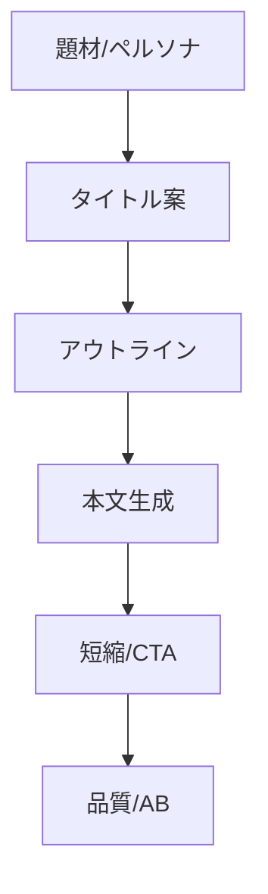

# YouTube原稿作成システム 設計と運用ガイド

## 目的
- 題材→フック→アウトライン→原稿→短縮/品質検査まで自動生成。

## 主要機能/ファイル
- タイトル/フック: `scripts/title/*.py`
- アウトライン展開: `scripts/outline/*.py`
- 原稿生成: `scripts/pipeline/generate_script_one_shot.py`
- 短縮: `scripts/text/shorten_script.py`
- 品質/AB: `services/quality_metrics.py`, `ui/ab_dashboard.py`

## パイプライン


## 実行例
```bash
python scripts/pipeline/generate_script_one_shot.py   --topic "行動経済学で解説する集中力" --persona "初心者向け"   --out outputs/latest/youtube_script.md
```

## 運用
- 生成物を `docs/fact-check-reports/` フォーマットで検証
- `ui/ab_dashboard.py` で結果保存/再学習に反映

更新: 2025-08-14 16:49
