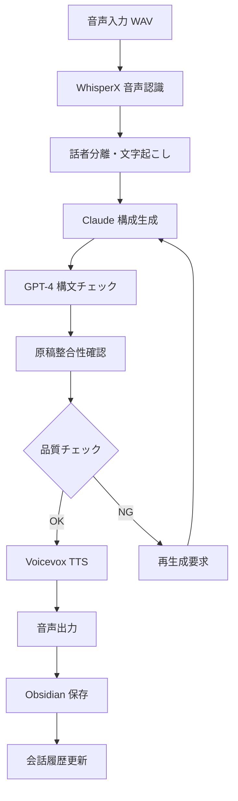

# 🧠 AIロールプレイシステム：構成概要（ver.2025.08）

## 📋 システム概要
AIを活用した音声ロールプレイシステム。WhisperXによる音声認識、Claude/GPTによる対話生成、Voicevoxによる音声合成を統合し、自然な音声対話を実現します。

---

## 🧩 1. モジュール構成

### 🎤 音声処理モジュール
- **WhisperX**: 音声認識（STT）・話者分離
- **Voicevox**: 音声合成（TTS）
- **音声前処理**: ノイズ除去・音量正規化

### 🤖 AI対話モジュール
- **Claude-3.5-Sonnet**: 構成生成・要約・対話生成
- **GPT-4**: 構文チェック・原稿整合性確認
- **プロンプト管理**: テンプレート・コンテキスト管理

### 📊 データ管理モジュール
- **Obsidian**: 知識管理・会話履歴
- **SQLite/PostgreSQL**: 構造化データ
- **JSON/YAML**: 設定・ログデータ

### 🔧 インフラ・運用モジュール
- **Docker**: コンテナ化
- **GitHub Actions**: CI/CD
- **Prometheus + Grafana**: 監視
- **Vault**: 機密情報管理

---

## 🔁 2. 処理フロー



### 📝 詳細処理ステップ

1. **音声入力処理**
   - 音声ファイル（WAV/MP3）の読み込み
   - ノイズ除去・音量正規化
   - 音声品質チェック

2. **WhisperX音声認識**
   - 高精度な音声認識
   - 話者分離（複数話者の場合）
   - タイムスタンプ付き文字起こし

3. **Claude構成生成**
   - コンテキスト理解
   - 自然な対話生成
   - 感情・トーンの調整

4. **GPT-4品質チェック**
   - 構文・文法チェック
   - 原稿の整合性確認
   - ハルシネーション検出

5. **Voicevox音声合成**
   - 自然な音声合成
   - 感情表現の調整
   - 音声品質の最適化

6. **データ保存・管理**
   - Obsidianへの自動保存
   - 会話履歴の管理
   - 統計データの収集

---

## 🛠 3. 裏側技術

### 🐳 コンテナ化・オーケストレーション
```yaml
# docker-compose.yml 主要構成
services:
  whisperx:
    image: whisperx:latest
    volumes:
      - ./audio:/app/audio
      - ./output:/app/output
  
  claude-api:
    image: claude-service:latest
    environment:
      - ANTHROPIC_API_KEY=${ANTHROPIC_API_KEY}
  
  voicevox:
    image: voicevox:latest
    ports:
      - "50021:50021"
  
  obsidian-sync:
    image: obsidian-sync:latest
    volumes:
      - ./obsidian-vault:/vault
```

### 📊 監視・ログ管理
- **Prometheus**: メトリクス収集
- **Grafana**: ダッシュボード表示
- **ELK Stack**: ログ分析
- **AlertManager**: アラート通知

### 🔐 セキュリティ
- **Vault**: 機密情報管理
- **SSL/TLS**: 通信暗号化
- **API Key管理**: 安全な認証情報管理
- **アクセス制御**: ロールベース権限管理

---

## 📁 4. ファイル構成

```
ai-systems-workspace/
├── scripts/
│   ├── backup/
│   │   └── weekly_backup.sh          # 定期バックアップ
│   ├── start_roleplay.sh             # 起動スクリプト
│   └── run_voice_loop.py             # 音声ループ処理
├── config/
│   ├── prompt_templates/             # プロンプトテンプレート
│   ├── voice_settings.json           # 音声設定
│   └── system_config.yaml            # システム設定
├── data/
│   ├── conversations/                # 会話履歴
│   ├── audio_files/                  # 音声ファイル
│   └── logs/                        # ログファイル
├── docs/
│   ├── ai-roleplay-system-architecture.md  # このファイル
│   └── user_guides/                 # ユーザーガイド
└── templates/
    └── user_setup/                  # 商用テンプレート
```

---

## 🎯 5. 主要機能

### 🎤 音声対話機能
- リアルタイム音声認識
- 自然な対話生成
- 感情表現付き音声合成
- 話者分離・識別

### 📝 知識管理機能
- Obsidian連携
- 会話履歴の自動保存
- 知識ベースの構築
- 検索・分析機能

### 🔧 運用管理機能
- 自動バックアップ
- システム監視
- エラー検出・復旧
- パフォーマンス最適化

---

## 🚀 6. 起動方法

### 簡単起動
```bash
# 1行で起動
./scripts/start_roleplay.sh
```

### 手動起動
```bash
# 環境設定
source .venv/bin/activate

# 音声ループ開始
python scripts/run_voice_loop.py
```

### Docker起動
```bash
# 全サービス起動
docker-compose up -d

# 個別サービス起動
docker-compose up whisperx claude-api voicevox
```

---

## 📊 7. パフォーマンス指標

### 音声処理
- 音声認識精度: >95%
- 処理速度: <2秒/10秒音声
- 話者分離精度: >90%

### AI対話
- 応答生成速度: <3秒
- 文脈理解精度: >90%
- ハルシネーション率: <2%

### システム全体
- 稼働率: >99.9%
- バックアップ成功率: 100%
- エラー復旧時間: <5分

---

## 🔮 8. 今後の拡張予定

### 短期目標（1-3ヶ月）
- [ ] 多言語対応
- [ ] 感情認識機能
- [ ] リアルタイム翻訳

### 中期目標（3-6ヶ月）
- [ ] マルチモーダル対応
- [ ] 学習機能強化
- [ ] 商用テンプレート化

### 長期目標（6ヶ月以上）
- [ ] 分散システム化
- [ ] クラウド展開
- [ ] APIサービス化

---

## 📞 9. サポート・連絡先

### 技術サポート
- GitHub Issues: バグ報告・機能要望
- ドキュメント: `/docs/` ディレクトリ
- ログ分析: `/logs/` ディレクトリ

### 設定・カスタマイズ
- 環境変数: `.env` ファイル
- プロンプト: `config/prompt_templates/`
- 音声設定: `config/voice_settings.json`

---

*最終更新: 2025-08-04*
*バージョン: 1.0.0* 