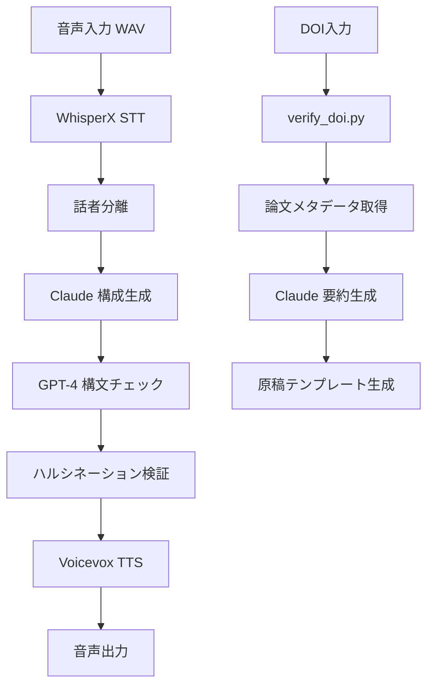

# 🧠 AIロールプレイシステム：構成概要（ver.2025.08）

## 🧩 1. モジュール構成

### 🤖 AI エンジン
- **WhisperX**: STT（音声認識）/ 話者分離
- **Voicevox**: TTS（音声合成）
- **Claude-3-Opus**: 構成・要約・対話生成
- **GPT-4**: 構文チェック・原稿整合性検証

### 🛠 インフラストラクチャ
- **Docker**: コンテナ化・環境統一
- **GitHub Actions**: CI/CD自動化
- **Vault**: シークレット管理
- **Prometheus + Grafana**: 監視・可視化

### 📝 知識管理
- **Obsidian**: ノート・構成管理
- **Git**: バージョン管理・バックアップ
- **iCloud**: クラウド同期

## 🔁 2. 処理フロー



### 詳細ステップ
1. **音声入力**（WAV形式）
2. **WhisperX**で文字起こし・話者分離
3. **Claude**に構成生成依頼
4. **GPT-4**で構造・ハルシネチェック
5. **Voicevox**で再TTS（希望時）

## 🛠 3. 裏側技術

### 🐳 コンテナ化
```yaml
services:
  ai-systems: # メインアプリ
  postgres: # データベース
  redis: # キャッシュ
  prometheus: # 監視
  grafana: # 可視化
```

### 🔄 CI/CD パイプライン
```yaml
workflows:
  - security-scan: # セキュリティスキャン
  - test: # ユニットテスト
  - build: # Dockerビルド
  - deploy: # デプロイ
  - monitoring: # 監視設定
```

### 📊 監視システム
- **Prometheus**: メトリクス収集
- **Grafana**: ダッシュボード
- **OpenTelemetry**: 分散トレーシング

## 🎯 4. 主要機能

### 📝 論文処理
- **DOI検証**: CrossRef API連携
- **メタデータ抽出**: タイトル・著者・出版年
- **要約生成**: Claude-3-Opus
- **原稿化**: 構造化テンプレート

### 🎤 音声処理
- **音声認識**: WhisperX（高精度）
- **話者分離**: 複数話者対応
- **音声合成**: Voicevox（日本語対応）
- **品質評価**: BLEU/ROUGEスコア

### 🤖 AI連携
- **Composer**: タスク管理・ルーティング
- **MCP**: モデル連携・拡張性
- **フィードバック**: 自動評価・改善提案

## 📁 5. ファイル構成

```
ai-systems-workspace/
├── scripts/
│   ├── verify_doi.py          # DOI検証
│   ├── check_hallucination.py # ハルシネーション検証
│   ├── validate_structure.py  # 構造検証
│   └── run_ai_pipeline.sh    # AIパイプライン
├── .cursor/
│   ├── composer.json          # Composer設定
│   └── mcp.json              # MCP設定
├── monitoring/
│   ├── prometheus/           # 監視設定
│   └── grafana/             # ダッシュボード
└── docs/
    └── system_architecture.md # このファイル
```

## 🔧 6. 設定・環境変数

### 必須環境変数
```bash
CLAUDE_API_KEY=your_claude_key
OPENAI_API_KEY=your_openai_key
GROQ_API_KEY=your_groq_key
DATABASE_URL=postgresql://...
REDIS_URL=redis://...
```

### オプション設定
```bash
WHISPERX_ENDPOINT=http://localhost:9000
VOICEVOX_ENDPOINT=http://localhost:50021
LOG_LEVEL=INFO
DEBUG=false
```

## 📊 7. パフォーマンス指標

### 処理時間
- **音声認識**: 30秒音声 → 5-10秒
- **話者分離**: 30秒音声 → 10-15秒
- **AI生成**: 1000文字 → 3-5秒
- **音声合成**: 1000文字 → 10-15秒

### 品質指標
- **BLEUスコア**: 0.7-0.9
- **ROUGEスコア**: 0.6-0.8
- **ハルシネーション率**: <5%
- **構文エラー率**: <2%

## 🚀 8. 起動方法

### 開発環境
```bash
# 依存関係インストール
source .venv/bin/activate
pip install -r requirements.txt

# 起動
uvicorn main_hybrid:app --host 0.0.0.0 --port 8000
```

### 本番環境
```bash
# Docker Compose起動
docker-compose up -d

# ヘルスチェック
curl http://localhost:8000/health
```

### バックアップ
```bash
# 週次バックアップ実行
./scripts/backup/weekly_backup.sh

# crontab設定（毎週月曜朝3時）
0 3 * * 1 bash ~/ai-driven/ai-systems-workspace/scripts/backup/weekly_backup.sh
```

## 📝 9. 更新履歴

- **2025-08-09**: システム構成図作成
- **2025-08-08**: CI/CD統合完了
- **2025-08-07**: Vault連携実装
- **2025-08-06**: Prometheus監視追加
- **2025-08-05**: Composer+MCP統合

---

*このドキュメントは自動生成され、システムの変更に応じて更新されます。*
